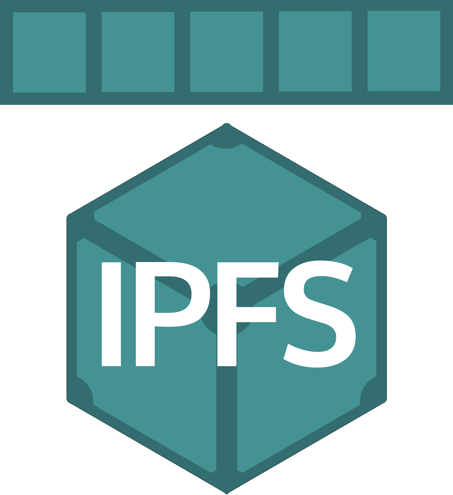

<!-- Improved compatibility of back to top link: See: https://github.com/othneildrew/Best-README-Template/pull/73 -->
<a name="readme-top"></a>
<!--
*** Thanks for checking out the Best-README-Template. If you have a suggestion
*** that would make this better, please fork the repo and create a pull request
*** or simply open an issue with the tag "enhancement".
*** Don't forget to give the project a star!
*** Thanks again! Now go create something AMAZING! :D
-->


<!-- PROJECT SHIELDS -->
<!--
*** I'm using markdown "reference style" links for readability.
*** Reference links are enclosed in brackets [ ] instead of parentheses ( ).
*** See the bottom of this document for the declaration of the reference variables
*** for contributors-url, forks-url, etc. This is an optional, concise syntax you may use.
*** https://www.markdownguide.org/basic-syntax/#reference-style-links
-->
[![Contributors][contributors-shield]][contributors-url]
[![Forks][forks-shield]][forks-url]
[![Stargazers][stars-shield]][stars-url]
[![Issues][issues-shield]][issues-url]
[![MIT License][license-shield]][license-url]
[![LinkedIn][linkedin-shield]][linkedin-url]


<!-- PROJECT LOGO -->
<br />
<div align="center">
  <a href="https://github.com/rbrb0014/next-ipfs">
    
  </a>

<h3 align="center">IPFS Decentral File Saving Strategy</h3>

  <p align="center">
    ipfs fragments saving strategy like cache
    <br />
    <a href="https://github.com/rbrb0014/next-ipfs"><strong>Explore the docs »</strong></a>
    <br />
    <br />
    <a href="https://github.com/rbrb0014/next-ipfs">View Demo</a>
    ·
    <a href="https://github.com/rbrb0014/next-ipfs/issues">Report Bug</a>
    ·
    <a href="https://github.com/rbrb0014/next-ipfs/issues">Request Feature</a>
  </p>
</div>


<!-- TABLE OF CONTENTS -->
<details>
  <summary>Table of Contents</summary>
  <ol>
    <li>
      <a href="#about-the-project">About The Project</a>
      <ul>
        <li><a href="#built-with">Built With</a></li>
        <li><a href="#supporting-database">Supporting Database</a></li>
      </ul>
    </li>
    <li>
      <a href="#getting-started">Getting Started</a>
      <ul>
        <li><a href="#prerequisites">Prerequisites</a></li>
        <li><a href="#installation">Installation</a></li>
      </ul>
    </li>
    <li><a href="#usage">Usage</a></li>
    <li><a href="#roadmap">Roadmap</a></li>
    <li><a href="#contributing">Contributing</a></li>
    <li><a href="#license">License</a></li>
    <li><a href="#contact">Contact</a></li>
    <li><a href="#acknowledgments">Acknowledgments</a></li>
  </ol>
</details>


<!-- ABOUT THE PROJECT -->
# About The Project

![Product Name Screen Shot][product-screenshot]

This project aims to fragment and encrypt files before storing them in a decentralized manner using IPFS. In addition to the mentioned API, we have also implemented an API for retrieving files stored in IPFS and an API for quickly retrieving files using cached fragment files. These APIs enhance the efficiency and speed of file retrieval by leveraging the distributed storage capabilities of IPFS and the cached fragment files.

<p align="right">(<a href="#readme-top">back to top</a>)</p>


## Built With

* [![Express][Express.js]][Express-url]
* [![IPFS][IPFS]][IPFS-url]

<p align="right">(<a href="#readme-top">back to top</a>)</p>

## Supporting Database

* [![Postgres][Postgres]][Postgres-url]

<p align="right">(<a href="#readme-top">back to top</a>)</p>


<!-- GETTING STARTED -->
# Getting Started

This is an example of how you may give instructions on setting up your project locally.
To get a local copy up and running follow these simple example steps.

## Prerequisites

This is an example of how to list things you need to use the software and how to install them.
* npm
  ```sh
  npm install npm@latest -g
  ```
* kubo

  Install Kubo(IPFS with GoLang) with following link below.  
  [Installation IPFS Kubo](https://docs.ipfs.tech/install/command-line/)

* Postgres Database setting

  ```sql
  CREATE SCHEMA ipfsdb;
  CREATE TABLE ipfsdb.data (
    id uuid DEFAULT uuid_generate_v4() NOT NULL,
    path varchar UNIQUE NOT NULL,
    mimetype varchar NOT NULL,
    localpaths _varchar NOT NULL,
    cids _varchar NOT NULL,
    keys _varchar NOT NULL,
    created_at timestamp DEFAULT NOW() NOT NULL,
    updated_at timestamp DEFAULT NOW() NOT NULL,
    deleted_at timestamp
  );

## Installation

1. Clone the repo
   ```sh
   git clone https://github.com/rbrb0014/next-ipfs.git
   ```
2. Install NPM packages
   ```sh
   npm install
   ```
3. Enter your ENV in `.env`
   ```
   # DB setting
   DB_DATABASE=    # DB name
   DB_HOST=        # Host address
   DB_PORT=        # Port number
   DB_USER=        # User name
   DB_PASSWORD=    # Password
   # etc
   SPLIT_COUNT=    # Number of fragmenting data (default 1)
   IV_STRING=      # Initial Vector for crypto (if string_length<16, default 'passwordpassword')
   ```

<p align="right">(<a href="#readme-top">back to top</a>)</p>


<!-- USAGE EXAMPLES -->
# Usage

Start your server with writing a command below on the console with your project path.
```sh
npm run start
```

APIs below are activated APIs. it always has `<host_ip>:3000` in front.

## POST /contents/disksplit
Save file with fragging and encrypt. Its frags saved in local file under `uploads/` and ipfs. Those data saved in database's table of `ipfsdb.data`.
### Arguments
* `path` [string]: Write path. Omit the initial slash. ex) `my/path` (o) `/my/path` (x)
### Request Body
It's multipart/form. It only needs `file` with an attaching file. File saved in their original name.
### Response
On success, the call to this endpoint will return with 200 and the following body:
```
"contents successfully saved"
```
  
## GET /contents/stream
Get file from ipfs server. It will give you original file you uploaded.
### Arguments
* `path` [string]: write path. Omit the initial slash. ex) `my/path/my_file_name.ext` (o) `/my/path/my_file_name.ext` (x)
### Request Body
None.
### Response
On success, the call to this endpoint will return with 200 and streamed file with mime type.

## GET /contents/cache
Get file from server's disk cache. It will give you original file you uploaded.
### Arguments
* `path` [string]: write path. Omit the initial slash. ex) `my/path/my_file_name.ext` (o) `/my/path/my_file_name.ext` (x)
### Request Body
None.
### Response
On success, the call to this endpoint will return with 200 and streamed file with mime type.

## DELETE /pin
It remove every data in ipfs pinned and database's ipfsdb.data table.
### Arguments
None.
### Request Body
None.
### Response
```
successfully unpinned
```

<p align="right">(<a href="#readme-top">back to top</a>)</p>

<!-- ROADMAP -->
# Roadmap

- [x] make post and get api using ipfs
- [x] use stream strategy for managing file
- [x] write initial readme
- [ ] make additional apis
  - [x] make get api using stored file fragments (cache-like)
- [ ] test with multiple ipfs nodes(actually, several desktop)

See the [open issues](https://github.com/rbrb0014/next-ipfs/issues) for a full list of proposed features (and known issues).

<p align="right">(<a href="#readme-top">back to top</a>)</p>


<!-- CONTRIBUTING -->
# Contributing

Contributions are what make the open source community such an amazing place to learn, inspire, and create. Any contributions you make are **greatly appreciated**.

If you have a suggestion that would make this better, please fork the repo and create a pull request. You can also simply open an issue with the tag "enhancement".
Don't forget to give the project a star! Thanks again!

1. Fork the Project
2. Create your Feature Branch (`git checkout -b feature/AmazingFeature`)
3. Commit your Changes (`git commit -m 'Add some AmazingFeature'`)
4. Push to the Branch (`git push origin feature/AmazingFeature`)
5. Open a Pull Request

<p align="right">(<a href="#readme-top">back to top</a>)</p>


<!-- LICENSE -->
# License

Distributed under the MIT License. See `LICENSE.txt` for more information.

<p align="right">(<a href="#readme-top">back to top</a>)</p>


<!-- CONTACT -->
# Contact

Gyujin Kim - rbrb0014@gmail.com

Project Link: [https://github.com/rbrb0014/next-ipfs](https://github.com/rbrb0014/next-ipfs)

<p align="right">(<a href="#readme-top">back to top</a>)</p>


<!-- ACKNOWLEDGMENTS -->
# Acknowledgments

* [Kubo RPC API](https://docs.ipfs.tech/reference/kubo/rpc/#api-v0-add)
* [IPFS-JS](https://github.com/ipfs-shipyard/java-ipfs-http-client)

<p align="right">(<a href="#readme-top">back to top</a>)</p>


<!-- MARKDOWN LINKS & IMAGES -->
<!-- https://www.markdownguide.org/basic-syntax/#reference-style-links -->
[contributors-shield]: https://img.shields.io/github/contributors/rbrb0014/next-ipfs.svg?style=for-the-badge
[contributors-url]: https://github.com/rbrb0014/next-ipfs/graphs/contributors
[forks-shield]: https://img.shields.io/github/forks/rbrb0014/next-ipfs.svg?style=for-the-badge
[forks-url]: https://github.com/rbrb0014/next-ipfs/network/members
[stars-shield]: https://img.shields.io/github/stars/rbrb0014/next-ipfs.svg?style=for-the-badge
[stars-url]: https://github.com/rbrb0014/next-ipfs/stargazers
[issues-shield]: https://img.shields.io/github/issues/rbrb0014/next-ipfs.svg?style=for-the-badge
[issues-url]: https://github.com/rbrb0014/next-ipfs/issues
[license-shield]: https://img.shields.io/github/license/rbrb0014/next-ipfs.svg?style=for-the-badge
[license-url]: https://github.com/rbrb0014/next-ipfs/blob/master/LICENSE.txt
[linkedin-shield]: https://img.shields.io/badge/-LinkedIn-black.svg?style=for-the-badge&logo=linkedin&colorB=555
[linkedin-url]: https://linkedin.com/in/gyujin-kim-b65731181
[database-structure-url]: https://github.com/rbrb0014/next-ipfs/blob/main/database.txt
[product-screenshot]: images/screenshot.png
[Express.js]: https://img.shields.io/badge/express.js-%23404d59.svg?style=for-the-badge&logo=express&logoColor=%2361DAFB
[Express-url]: https://expressjs.com/
[IPFS]: https://a11ybadges.com/badge?logo=ipfs
[IPFS-url]: https://ipfs.tech/
[Postgres]: https://img.shields.io/badge/postgres-%23316192.svg?style=for-the-badge&logo=postgresql&logoColor=white
[Postgres-url]: https://www.postgresql.org/
